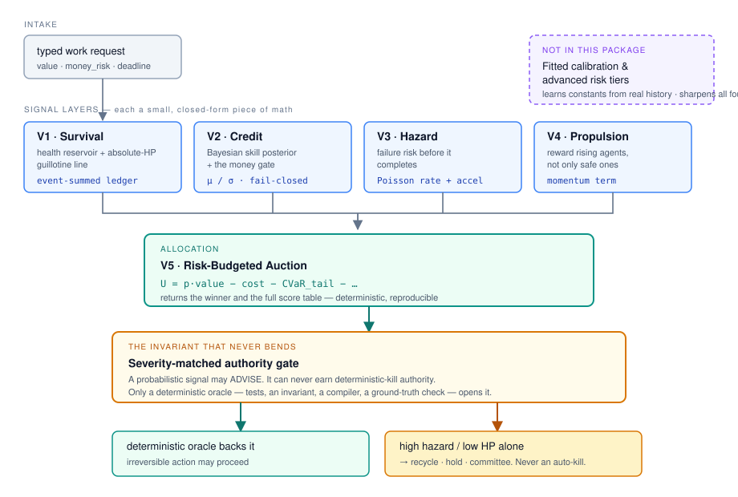

# Architecture

How the V1–V5 control plane is wired, what each layer is allowed to decide,
and the one rule that never bends.



---

## The shape in one paragraph

Four **signal layers** score every candidate agent independently. A fifth
layer, the **auction**, combines those scores into a single risk-adjusted
utility and allocates the work. Everything the auction produces then passes a
**severity-matched authority gate** before anything irreversible happens. The
gate is not a policy setting — it is a structural property of the stack, and
it is the reason a confident statistical signal cannot, on its own, end an
agent.

| | Layer | Decides | Math |
|---|---|---|---|
| **V1** | Survival | is this agent still viable | event-summed HP ledger, absolute guillotine line |
| **V2** | Credit | has it *proven* skill, and how sure are we | Bayesian posterior μ/σ, fail-closed money gate |
| **V3** | Hazard | how likely is failure *before* completion | Poisson base rate + acceleration |
| **V4** | Propulsion | is it improving | momentum term |
| **V5** | Auction | who earns this task, under a risk budget | `U = p·value − cost − CVaR_tail − …` |

V1–V4 never allocate. V5 never invents a signal. Keeping those two facts
separate is what makes the stack auditable: a bad allocation is traceable to
either a bad signal or a bad objective, never to an unattributable blend.

---

## The governed lifecycle

Allocation is one step in a longer chain. The open frame is:

```
intent → typed work → valuation → eligibility → allocation
       → fenced lease → execution → typed result → review → evidence update
```

**Every arrow must emit an immutable event or receipt.** Each receipt binds
the work identity, the workflow version, the mandate version, the actor
identity, the previous event hash, and the input or output hash relevant to
that specific transition.

The consequence is worth stating plainly, because it is the part most systems
get backwards:

> **A dashboard is a view over this event history. It is not the source of
> truth.**

A panel that cannot name the event it is derived from is not evidence. If the
chain is intact, any number on any screen can be walked back to the receipt
that produced it; if it is not, the number is decoration.

### Why the lease is *fenced*

Between allocation and execution the winning agent takes a lease. That lease
carries a strictly increasing **fencing token**, and the result store accepts
a transition only when the presented token equals the currently active token
for that work item.

**Theorem — single-writer effect under fencing.**
Let every successful claim receive a strictly increasing token `f ∈ ℕ`, and
let the result store accept a transition only when the presented token equals
the active token. Then a worker holding an expired token cannot commit a
result after a newer claim has been granted.

*Proof sketch.* A later claim carries `f' > f` and becomes the active token.
The equality precondition rejects any subsequent transition presenting `f`.
Note what this does **not** require: the clocks of the two workers need never
agree. It requires only an atomic token comparison at the authoritative
store. ∎

*Failure mode.* A lease ID without a monotone token is insufficient. A worker
that pauses — GC, a suspended VM, a laptop lid — can wake after its lease has
expired and overwrite newer work, unless **every** side effect re-checks the
token at the moment of the write. A check at claim time is not a check.

---

## The invariant that never bends

> A probabilistic signal can **advise**. It can never earn deterministic-kill
> authority.

Only a deterministic oracle — a test suite, an invariant, a compiler, an
explicit ground-truth check — may authorize an irreversible action. High
hazard or low HP on their own route to recycle, to hold, or to a human or
committee. They never auto-kill.

This is enforced in the V1 survival and V5 allocation layers rather than
applied as a rule on top, so it holds regardless of how good a statistical
signal happens to look on a given day. The distinction it protects is between
*confidence* and *authority*: a model that is right 99% of the time is a
superb advisor and an unacceptable executioner, because the 1% is
unrecoverable.

The same asymmetry produces the money gate in V2: proven skill **and** low
uncertainty are both required before an agent touches money. Low uncertainty
about mediocre skill is not a pass, and high skill with wide error bars is
not either.

---

## Where the boundary of this package is

This repository is the **complete, working open baseline** — the real V1–V5
math, MIT-licensed, no crippled stubs. It runs on its own.

What is deliberately **not** here: the fitted calibration and advanced risk
tiers — the layer that learns these constants from real outcome history and
stages an evidence-gated rollout of a changed policy. That layer sharpens the
same decisions on real dispatch data. It is referenced above only by shape,
and the diagram marks it as outside the package.

The frame is open. The fitted overlay is not.

---

## Determinism, and why it is load-bearing

Every tool is **stateless at call time**: prior state arrives as plain JSON
and the result is a pure function of it. Run the same inputs twice and get the
same answer, on any machine, offline.

That is not an aesthetic preference. It is what makes the audit trail mean
something — a receipt that cannot be replayed to the same result is a record
of an event, not evidence about it. It is also what lets the whole stack be
unit-tested without a fleet, a database, or a network.
